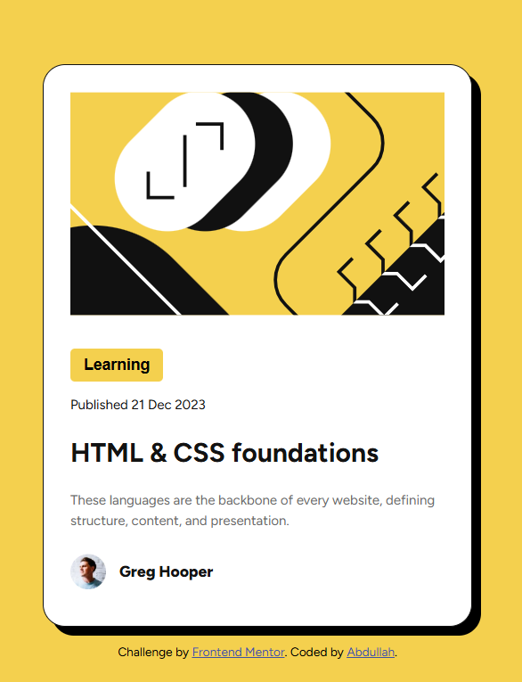

# Frontend Mentor - Blog Preview Card Solution

This is my attempted solution to the Blog Preview Card Challenge on [Frontend Mentor](https://www.frontendmentor.io/challenges/blog-preview-card-ckPaj01IcS). The challenge required building building a responsive layout for a blog card.

## Live Demo

[Live Demo of Blog Preview Card](https://weebdora.github.io/blog-preview-card/)

## Screenshot 

## What I learned myself

- Applied Web Fonts again. This time, I used a font-face rule instead
- Learning from the QR project, I used max-width and Flexbox instead of multiple media queries
- Got more experience with Figma. Learned how to identify hover states, worked with spacing
- Used CSS variables for the first time in a project 

## Improvements

 <!-- Will add this part after I get a review from others and AI -->